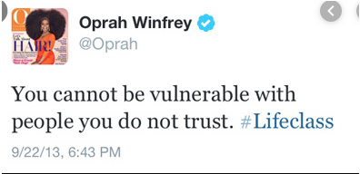

# Loops in JS

*Whatever the mind can conceive and believe, it can achieve ―Napoleon Hill*

## Overview

Looping over strings, objects, and arrays is a very common task performed by developers every day. **It is your job to understand why, how, and when to do it**. Today we'll cover how and when to use loops.

As to the why, think about the list of tweets you might have tweeted in the past year. Somewhere in one of Twitter's databases there is an array of all of the tweets you've ever sent. When you or someone else requests to look at your tweets your array of tweets is passed through a function. This function loops over each of your tweets and returns them to your phone in the form of a well designed visual:



*****

But really the data storage of Oprah's tweets might look like this:

```json
{ "username": "oprah",
  "tweets": [
    {"id": 456902121573453824, "chars": 71, "createdOn": 9/22/13, "text": "HI TWITTERS . THANK YOU FOR A WARM WELCOME. FEELING VERY 21st CENTURY ."},
    {"id": 616902427573483009, "chars": 80, "createdOn": 11/18/12 , "text": "Gotta say love that SURFACE! Have bought 12 for Christmas gifts. #FavoriteThings"},
    {"id": 723904526771785431, "chars": 65, "createdOn": 9/22/13 , "text": "You cannot be vulnerable with people you do not trust. #Lifeclass"}
  ]
}
```

To build a function that would return the specific tweet or all of the `tweets` we would need to loop over the array of tweets on the oprah object.

It is for this reason that you should learn every array method there is and get good at looping through arrays. Many developer problems are solved this way!

## The Loops of JavaScript

Loops are a way to repeat, or **iterate**, over a JavaScript thing and perform a certain **block of code** over and over until the stop condition is met.

We can think of this as giving directions for someone to navigate to our house:

1. From I-35 North, exit Berger Rd,
2. Turn right,
3. Drive 5.2 miles and look right for the red fence.

The *Drive for 5.2 miles* is the **action statement** of the loop. It says, *continue driving* until the **stop condition**: *5.2 miles, is met*.

Obviously this is only a metaphor and we'll have to visualize how loops work in coding, so let's get to that. The [common loops](https://www.w3schools.com/js/js_loop_for.asp){:target="_blank"} we use as web developers are, listed from most often used to least often used:

* **for** - loops through a block of code a specific number of times
* **for/of** - loops through the values of an iterable object like an array.
* **for/in** - loops through the properties of an object or indexes of an array.
* **while** -  loops through a block of code while a specified condition is true
* **do/while** - also loops through a block of code while a specified condition is true

When deciding what loop to use, ask yourself:

* **What is the stop condition (what makes the loop end)?**

**BEWARE the INFINITE LOOP**
  
  > An Infinite Loop is a loop without a stop condition!!

* This should be avoided at all costs. But this is something you'll just have to learn on your own.
* This will crash the browser or the JavaScript program that you are in.

### For Loops

**For loops** are most commonly used to iterate over arrays and strings. The **stop condition** is usually the length of the array.

A for loop repeats until a specified condition evaluates to false.

```javascript
  // this is pseudo-code just to help you visualize & learn the syntax of the for loop
  for ([initial expression]; [stop condition]; [increment expression]){
    action statement
  }
```
  
  > In the example below, we use a for loop to print out numbers from 1 - 10.

```javascript
  // let's put the for loop inside a function so we can call it when we want instead of just when the program is run.

  const countUpToTen = () => {
    for (let i = 1; i <= 10; i++) {
      console.log(i);
    }
  }

  countUpToTen()

  // Your turn!

  // * Create a for loop that prints out every multiple of 3 up to 100.
```

Paste the code above into a Repl.it and try it yourself.

Let's focus on the first line: `for (let i = 1; i <= 10; i++)`.

* `for()` looks just like a function invocation. And it is. We pass into it the following argument:
* `let i = 1;` is the **initial expression**. It states that the iterator, i, will start at 1.
* `i <= 10;` is the **stop condition**. It states that the loop will stop when the iterator reaches 10 or more.
* `i++` is the **increment expression**. It increases the iterator by 1 each time the loop runs through.

  > NOTE: We could also decrease by one with i--, increase or decrease by two: i+=2, i-=2, or whatever the problem might need.

In the second line: `{ console.log(i); }`

* `{ }` is the **action statement**. Whatever is inside these curly braces will be performed once every time the loop is run until the stop condition is met.
* `console.log(i)` will log to the console the current value of i.
These fundaments are the same in all loops but you'll see that the syntax changes just a little with each.

### The Other For Loops - For/In and For/Of

These two loops are similar but there is a very distinct difference between them!

* The **for/in** loop returns the keys or indexes of the thing it's iterating over.
* The **for/of** loop returns the value at the current index or key of the thing it's iterating over.

#### For/In loop

This loop is used to iterate over **object-literals** which have key-value pairs. In the code snippet below we see that the object, person, is passed into the function `loopOverObject`.

Then we set two variables that we expect to change: `let text = "";` and `let x;`.

```javascript
  const person = {firstName: "Peter", lastName: "Wisser", age: 25};

  const loopOverObject = (obj) => {
    let text = "";
    let x;

    for (x in obj) {
      text += obj[x] + " ";
    }
    return text
  }

  loopOverObject(person)
```

When we invoke the function, the **for/in** loop will iterate over the `person` object using the `x` variable as a placeholder for each of the keys in the object: `firstName`, `lastName`, then `age`. It's like saying, "for however many keys are in the object, use x to describe each one as we loop over the object."

Then we see: `text += obj[x] + " ";` which says the variable `text` now equals whatever it was plus the value of the current key, x, and then add a space, `" "`, just for readability.

After the loop is over return the things we added to the `text` variables.

#### For/Of Loops

The **for/of** loop works the same way as the **for/in** loop but instead of objects, it's used on arrays.


```javascript
  const writers = ["Dickinson", "Steinbeck", "Huxley"]

  const loopOverArray = (arr) => {
    let text = "I love to read ";
    let author;

    for (author of arr) {
      text += author + " and... ";
    }
    return text
  }

  loopOverArray(writers)
```

This loop and the **for** loop are the most common loops you'll be using throughout your career and this course.

#### The Do...While Loop

**While** and **do/while** loops are used to perform a block of code over and over until a certain condition evaluates to true.

For front-end development, it is fairly rare that a while or do while loop would be the best option but, for the sake of thoroughness...

A **do/while** loop repeats something until the condition is evaluated as false.

```javascript

  //  again, pseudo-code here so you can see it more clearly.
  do { 
    action statement
  } while (stop condition);
  // Check out what's going on below:

  const celebrateBirthday = () => {
    let age = 0;

    do {
      age += 1;
      console.log("Happy Birthday!! Today you are " + age + " year old!");
    } while (age < 20);
  }

  celebrateBirthday()
```

Copy/paste the code above into a Repl.it and let's quickly break this down:

* `let age = 0;` - create a variable that's expected to change and set it to 0
* `do { }` - create an action statement
  * `age += 1;` - each time the loop runs add 1 to the age variable
  * `console.log("blah blah blah")` - you know what this does
* `while (age < 20)` - establish a stop condition: when age is equal to or greater than 20 stop doing the action statement and break out of the loop.

#### The While Loop

```javascript
  while (condition) {
    action statement
  }
```

  > Explore the example below:

```javascript
  const logGrade = () => {
    let grade = 0;
    while (grade < 70) {
      grade += 10;
      console.log("You have a " + grade + " in this class and cannot move on to the next class until your grade is higher than a 70.");
    }
  }

  logGrade()
```

  > Throw this code into a Repl.it and work through it on your own. Your ability to read code is what's going to get you to go far!!

## Practice It

### Loops 1

- [ ] Copy/paste this code into a new [Repl.it](https://Replit.com){:target="_blank"}
- [ ] Then follow the instructions in the comments.

```javascript
  const users = {
    232: 'renee',
    5656: 'mark',
    5546: 'devin',
    3353: 'grace',
    4894: 'michael',
    6644: 'becca'
  }

  // * Write a for/of loop that console logs each of the user names in the users object

  // * Write a for/in loop that console logs each of the keys in the users object
```

### Loops 2

- [ ] Copy/paste this code into a new [Repl.it](https://Replit.com){:target="_blank"}
- [ ] Then follow the instructions in the comments.

```javascript
  // * Create an object with keys and values called "person" with the following data:
  // firstName: “Jane”
  // lastName: “Doe”
  // birthDate: “Jan 5, 1925”
  // gender: “female”

  // * Use a for/in loop to console.log each key.

  // * Create an array of 5 objects that have the same structure as "person" with the same keys but with different values.

  // * Write a for/of loop inside a for/in loop that logs each of the values for all 5 persons

  // * Then use a for/of loop and if statement to console.log only the objects with the keys: firstName and birthDate.
```

## Know Your Docs

* [MDN Docs - While](https://developer.mozilla.org/en-US/docs/Web/JavaScript/Reference/Statements/while){:target="_blank"}
* [MDN Docs - Break](https://developer.mozilla.org/en-US/docs/Web/JavaScript/Reference/Statements/break){:target="_blank"}
* [MDN Docs - For...In](https://developer.mozilla.org/en-US/docs/Web/JavaScript/Reference/Statements/for...in){:target="_blank"}
* [MDN Docs - For...Of](https://developer.mozilla.org/en-US/docs/Web/JavaScript/Reference/Statements/for...of){:target="_blank"}
* [MDN Docs - Do...While](https://developer.mozilla.org/en-US/docs/Web/JavaScript/Reference/Statements/do...while){:target="_blank"}

## Additional Resources

* [Video - JS For Loops](https://youtu.be/BxFi7vVZx4s){:target="_blank"}


<!-- 


```javascript

```

- [ ] Task Two
    *  [ ] Task Two.a
    *  [ ] Task Two.b
    *  [ ] Task Two.c


| Method      | Description                          |
| ----------- | ------------------------------------ |
| `GET`       | Fetch resource                       |
| `PUT`       | Update resource |
| `DELETE`    | Delete resource |


* [MDN Docs - ...]()

- [ ] ...
- [ ] ...


```javascript

``` 

- [ ] ...
- [ ] ...
  * [ ] ...
  * [ ] ...

    `line numbers`
:do you like 'em?

=== "Javascript"

    ```javascript
    ```

=== "Python"

  ```python
  ```

cp workspace/resources/templateFile.md docs/preCourse/module-

-->