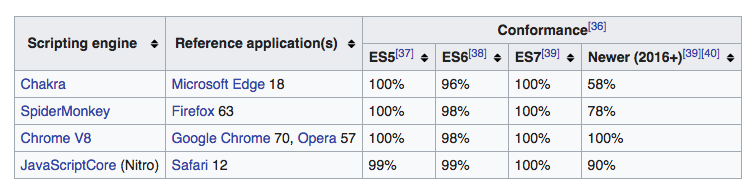

# ES5 vs ES6

Coding languages are standardized and maintained by groups or councils of people that work with and listen to the developers that use the language. Therefore languages are updated and improved periodically. JavaScript is no different. In fact, it may be one of the most rapidly improved and frequently changed languages.

The body of people that maintain JavaScript is called the [ECMA-262](https://en.wikipedia.org/wiki/ECMAScript) which is overseen by the the [ECMA International](https://en.wikipedia.org/wiki/Ecma_International). The ECMA-262 made its first edition in 1997 and its latest edition came out in June 2018: ES2018 (ES9).

The reason we're talking about ES6 and not ES9 here is that ES6 was the biggest renovation of the language and is now the standard of the language used across multiple platforms. While there are newer features in the newer editions it is important to remember that the engines that run JavaScript, like [Chrome V8 JS Engine](https://en.wikipedia.org/wiki/V8_(JavaScript_engine)), have to all be updated for these newer features, so each platform can talk back and forth to one another. This process takes time so the official edition of the language in use is always a few years behind where the latest edition actually is.

Note on transpiling(sic) from [Wikipedia](https://en.wikipedia.org/wiki/ECMAScript):

> Since ES 2015, transpiling JavaScript has become very common. Transpilation is a source to source compilation in which the newer versions of JavaScript are used in the user's source code and the transpiler rewrites them so that they are compliant with the current specification. Usually, transpilers transpile down to ES3 to maintain compatibility with all versions of browsers. The settings to transpiling to a specific version can be configured according to need. Transpiling adds an extra step to the build process and is sometimes done to avoid needing polyfills. Polyfills allow adding extra functionalities by including another JavaScript file which adds those specific functionalities.

That said you should keep abreast of the recent changes in the languages you write so that you can utilize the fun new features!! So, as you learn in the course, watch videos and read blogs by other developers. They'll give you free information to use as you want.

  > NOTE: The image below describes another reason we use Chrome as our default browser. Notice the conformance percentage for later versions of JS (ECMA).



## ES5 vs ES6: How

<iframe src="https://player.vimeo.com/video/377103400" width="900" height="600" frameborder="0" allow="autoplay; fullscreen" allowfullscreen></iframe>

The code snippets below both declare a function called `imAFunction` and take in a argument called `content`

ES2011 (ES5):

```javascript
  // hold a function as the value of a variable. Takes one argument: `parameter`
  var imAFunction = function(parameter) {
      // Do stuff here
  }
```

ES2015 (ES6):

```javascript
// same thing, taking one argument
const imAFunction = parameter => {
    // Do stuff here
}

// function taking two arguments
const imAFunction2 = (parameter, parameter2) => {
    // Do stuff here
}

// function taking zero arguments
const imAFunction3 = () => {
    // Do stuff here
}
```

The code snippets below all create the same variable, `myVariable`:

Pre-ES2015

```javascript
var myVariable = 10;
```

ES2015

```javascript
let myVariable = 10 
const myVariable2 = 10

// use `let` if you expect the variable to change
// use `const` if you expect the variable to be a constant value
```

## ES6 Why?

### Let, Const, Var

<iframe width="891" height="501" src="https://www.youtube.com/embed/sjyJBL5fkp8" frameborder="0" allow="accelerometer; autoplay; clipboard-write; encrypted-media; gyroscope; picture-in-picture" allowfullscreen></iframe>

### Fat Arrow Syntax `() => {}`

<iframe width="891" height="501" src="https://www.youtube.com/embed/RGUAZbXTtP8" frameborder="0" allow="accelerometer; autoplay; clipboard-write; encrypted-media; gyroscope; picture-in-picture" allowfullscreen></iframe>

## Additional Resources

- [ ] [FunFunFunction - Fat Arrow Function](https://youtu.be/6sQDTgOqh-I)

  > NOTE: Don't get caught up on `.filter()`, `.map()` or `.reduce()`. These are really powerful built-in methods we will cover in-depth later on, together in class.